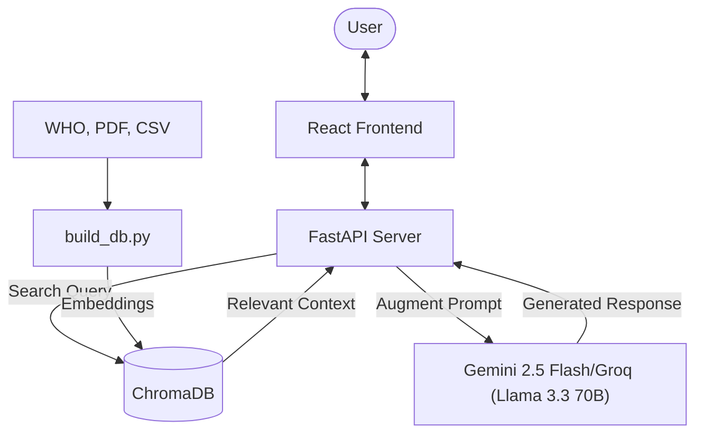

# MediChat: Smart Disease Education Chatbot



MediChat is a Retrieval-Augmented Generation (RAG) chatbot designed to provide warm, calm, and accurate educational information about diseases. It combines a modern React frontend with a powerful FastAPI backend, utilizing ChromaDB for vector storage and Google's Gemini AI for embeddings and generation.

## 🚀 Key Features

-   **RAG Architecture**: Uses real-time retrieval from a curated medical knowledge base to ground AI responses.
-   **Multi-Source Ingestion**: Automatically processes WHO fact sheets, clinical PDFs, and large-scale clinical datasets (MIMIC-III).
-   **Smart Formatting**: Frontend supports full Markdown rendering for clear medical lists and bold highlights.
-   **API Quota Management**: Built-in optional chunk sampling to handle free-tier API limits during large data ingestion.
-   **Empathetic UI**: Designed with a "glassmorphism" aesthetic, micro-animations, and a supportive tone.

## 🛠️ Tech Stack

-   **Frontend**: React (Vite), Tailwind CSS, Framer Motion, Lucide Icons.
-   **Backend**: FastAPI, Uvicorn, Python.
-   **AI/ML**: Google Gemini API (`gemini-2.5-flash`, `gemini-embedding-001`); Groq API (`llama-3.3-70b-versatile`, `sentence_transformers`).
-   **Vector Store**: ChromaDB.
-   **Data Processing**: BeautifulSoup4, PyPDF, Pandas.

## 📋 Prerequisites

-   Python 3.10+
-   Node.js & NPM
-   A Google Gemini API Key

## ⚙️ Setup & Installation

### 1. Environment Setup
Create a `.env` file in the root directory:
```env
GEMINI_API_KEY=your_api_key_here
GROQ_API_KEY=your_groq_api_key_here
```

### 2. Backend Installation
```bash
python3 -m venv .venv
source .venv/bin/activate
pip install -r requirements.txt
```

### 3. Frontend Installation
```bash
cd frontend
npm install
cd ..
```

## 🏃 Running the Application

### Phase 1: Build the Knowledge Base
Ingest the medical data into the vector database:
```bash
python3 vectorstore/build_db.py
```

If you want to use Groq instead of Gemini write this command:
```bash
python3 vectorstore/build_db_grok.py
```
*Note: You can adjust `SAMPLE_SIZE` in `build_db.py` to limit the number of new chunks ingested per run.*

### Phase 2: Start the Backend
```bash
python3 -m uvicorn main:app --reload
```
Or for Groq
```bash
python3 -m uvicorn main_groq:app --reload
```

### Phase 3: Start the Frontend
```bash
cd frontend
npm run dev
```

## 🧠 How it Works (RAG Flow)

1.  **Ingestion**: `build_db.py` extracts text from HTML, PDF, and CSV files, chunks it, and generates embeddings.
2.  **Storage**: Embeddings and metadata are stored in a local ChromaDB instance (`chroma_db/`, `chroma_db_groq/`).
3.  **Retrieval**: When a user asks a question, the server embeds the query and searches ChromaDB for the most relevant context chunks.
4.  **Augmentation**: The context is injected into a specialized `SYSTEM_PROMPT` that enforces medical safety and calm reassurance.
5.  **Generation**: Gemini 2.5 Flash generates a response grounded strictly in the provided context.
6.  **Formatting**: The frontend renders the response as Markdown for a clean, professional look.

## 📊 Evaluation

The RAG pipeline is evaluated using retrieval quality metrics over a test dataset of 50 medical questions covering diseases, mental health, injuries, and more.

### Running the Evaluation
```bash
# Retrieval metrics only (no API cost beyond embeddings)
python -m evaluation.evaluate --retrieval-only

# Full evaluation with LLM-as-judge scoring (uses Gemini API quota)
python -m evaluation.evaluate --limit 5
```

Or for Groq:
```bash
# Retrieval metrics only (no API cost beyond embeddings)
python -m evaluation.evaluate_groq --retrieval-only

# Full evaluation with LLM-as-judge scoring (uses Groq API quota)
python -m evaluation.evaluate_groq --limit 5
```

### Retrieval Metrics (Score for GEMINI)

| Metric | Score | Description |
|---|---|---|
| **Hit Rate** | 1.00 | Retrieval always returns at least one chunk from the correct source |
| **MRR** | 0.94 | Mean Reciprocal Rank — correct source is ranked 1st almost every time |
| **Source Precision** | 0.68 | 68% of retrieved chunks come from the expected source |
| **Overall** | 0.87 | Simple average of retrieval metrics (not a formal metric) |

### Retrieval Metrics (Score for Groq)

| Metric | Score | Description |
|---|---|---|
| **Hit Rate** | 1.00 | Retrieval always returns at least one chunk from the correct source |
| **MRR** | 0.89 | Mean Reciprocal Rank — correct source is ranked 1st almost every time |
| **Source Precision** | 0.58 | 58% of retrieved chunks come from the expected source |
| **Overall** | 0.82 | Simple average of retrieval metrics (not a formal metric) |

### LLM-as-Judge Metrics (optional, requires API calls)

| Metric | Description |
|---|---|
| **Faithfulness** | Is the answer grounded in the retrieved context (no hallucination)? |
| **Answer Relevance** | Does the answer address the user's question? |
| **Context Relevance** | Are the retrieved chunks relevant to the question? |
| **Correctness** | Is the answer factually consistent with the ground truth? |

## 🛡️ Medical Disclaimer
This application is for educational purposes only and should not be used as a substitute for professional medical advice, diagnosis, or treatment.
