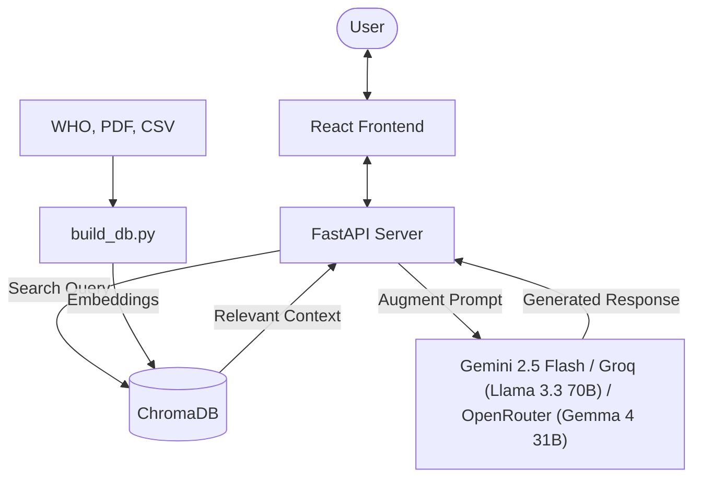
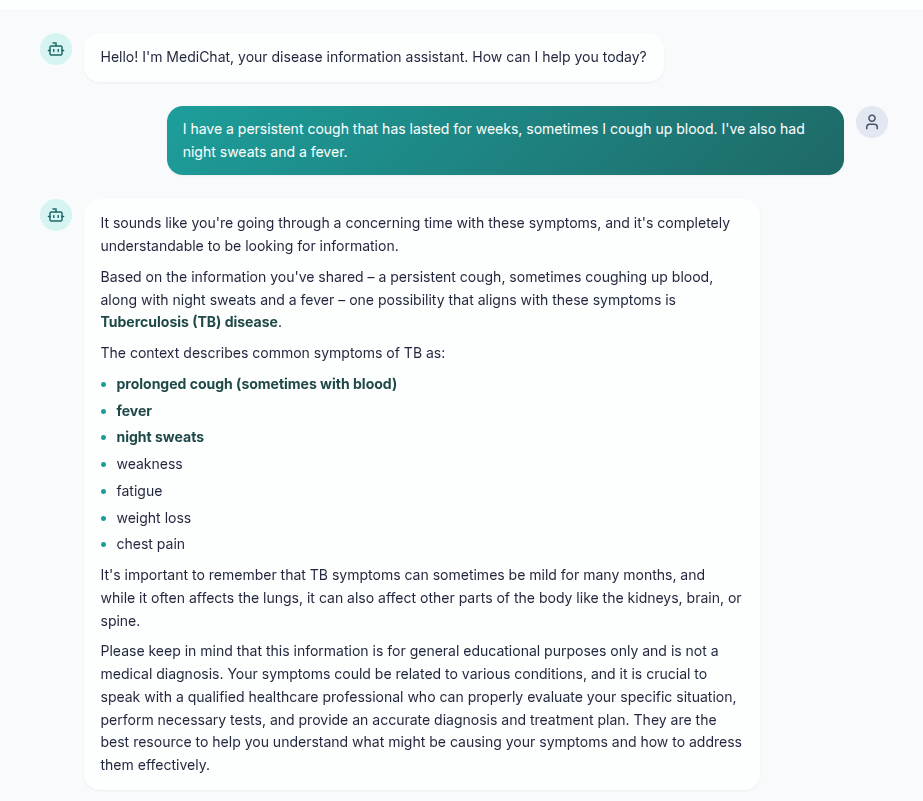
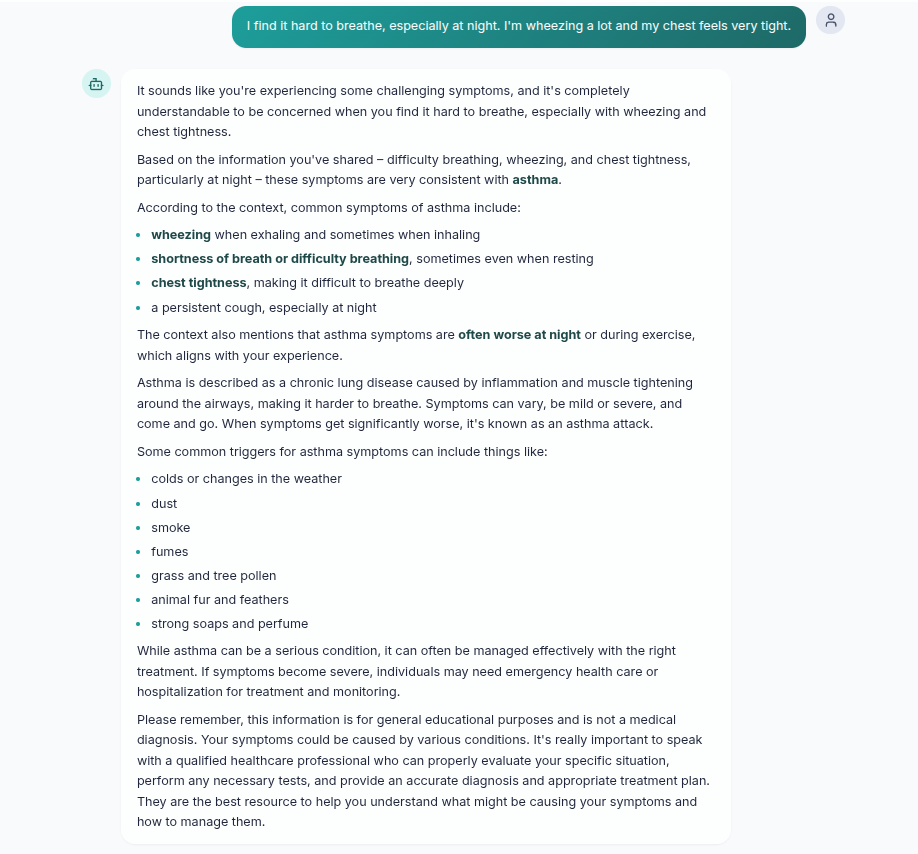
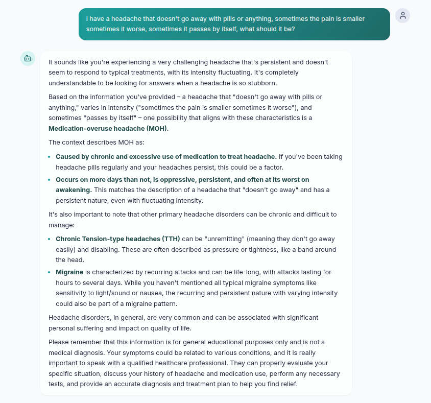

# MediChat: Smart Disease Education Chatbot


```mermaid
graph TD
    User([User]) <--> Frontend[React Frontend]
    Frontend <--> Backend[FastAPI Server]
    Backend -- Search Query --> VectorDB[(ChromaDB)]
    VectorDB -- Relevant Context --> Backend
    Backend -- Augment Prompt --> LLM["Gemini 2.5 Flash / Groq (Llama 3.3 70B) / OpenRouter (Gemma 4 31B)"]
    LLM -- Generated Response --> Backend
    
    Data[WHO, PDF, CSV] --> Ingest[build_db.py]
    Ingest -- Embeddings --> VectorDB
```

MediChat is a Retrieval-Augmented Generation (RAG) chatbot designed to provide warm, calm, and accurate educational information about diseases. It combines a modern React frontend with a powerful FastAPI backend, utilizing ChromaDB for vector storage and a choice of AI providers for generation.

## 🚀 Key Features

-   **RAG Architecture**: Uses real-time retrieval from a curated medical knowledge base to ground AI responses.
-   **Multi-Source Ingestion**: Automatically processes WHO fact sheets, clinical PDFs, and large-scale clinical datasets (MIMIC-III).
-   **Multi-Provider Support**: Supports Google Gemini, Groq, and OpenRouter as interchangeable LLM backends.
-   **Smart Formatting**: Frontend supports full Markdown rendering for clear medical lists and bold highlights.
-   **API Quota Management**: Built-in optional chunk sampling to handle free-tier API limits during large data ingestion.
-   **Empathetic UI**: Designed with a "glassmorphism" aesthetic, micro-animations, and a supportive tone.

## 🛠️ Tech Stack

-   **Frontend**: React (Vite), Tailwind CSS, Framer Motion, Lucide Icons.
-   **Backend**: FastAPI, Uvicorn, Python.
-   **AI/ML**: Google Gemini API (`gemini-2.5-flash`); Groq API (`llama-3.3-70b-versatile`); OpenRouter API (`google/gemma-4-31b-it:free` or any free model); all use `sentence_transformers` for local embeddings.
-   **Vector Store**: ChromaDB.
-   **Data Processing**: BeautifulSoup4, PyPDF, Pandas.
-   **Statistics**: NumPy, SciPy (`evaluation/statistical_analysis.py`).

## 📋 Prerequisites

-   Python 3.10+
-   Node.js & NPM
-   A Google Gemini API Key, Groq API Key, or OpenRouter API Key (depending on which backend you use)

## ⚙️ Setup & Installation

### 1. Environment Setup
Create a `.env` file in the root directory:
```env
GEMINI_API_KEY=your_gemini_api_key_here
GROQ_API_KEY=your_groq_api_key_here
OPENROUTER_API_KEY=your_openrouter_api_key_here
```

### 2. Backend Installation
```bash
python3 -m venv .venv
source .venv/bin/activate
pip install -r requirements.txt
```

### 3. Frontend Installation
```bash
cd frontend
npm install
cd ..
```

## 🏃 Running the Application

### Phase 1: Build the Knowledge Base
Ingest the medical data into the vector database:
```bash
# Gemini
python3 vectorstore/build_db.py

# Groq
python3 vectorstore/build_db_groq.py

# OpenRouter (uses the same local sentence-transformers embeddings as Groq)
python3 vectorstore/build_db_open_router.py
```
*Note: You can adjust `SAMPLE_SIZE` in `build_db.py` to limit the number of new chunks ingested per run.*

### Phase 2: Start the Backend
```bash
# Gemini
python3 -m uvicorn main:app --reload

# Groq
python3 -m uvicorn main_groq:app --reload

# OpenRouter
python3 -m uvicorn main_open_router:app --reload
```

### Phase 3: Start the Frontend
```bash
cd frontend
npm run dev
```

## 🧠 How it Works (RAG Flow)

1.  **Ingestion**: `build_db.py` extracts text from HTML, PDF, and CSV files, chunks it, and generates embeddings using `all-MiniLM-L6-v2` (local, no API cost).
2.  **Storage**: Embeddings and metadata are stored in a local ChromaDB instance (`chroma_db/`, `chroma_db_groq/`, `chroma_db_open_router/`).
3.  **Retrieval**: When a user asks a question, the server embeds the query and searches ChromaDB for the most relevant context chunks.
4.  **Augmentation**: The context is injected into a specialized `SYSTEM_PROMPT` that enforces medical safety and calm reassurance.
5.  **Generation**: The configured LLM generates a response grounded strictly in the provided context.
6.  **Formatting**: The frontend renders the response as Markdown for a clean, professional look.

## 📊 Evaluation

The RAG pipeline is evaluated using retrieval quality metrics over a test dataset of 50 medical questions covering diseases, mental health, injuries, and more. Automatic retrieval scores can be compared with optional LLM-as-a-Judge scores using Spearman correlation (see [Statistical comparison](#statistical-comparison-automatic-metrics-vs-llm-as-a-judge)).

### Running the Evaluation
```bash
# Gemini — retrieval only
python -m evaluation.evaluate --retrieval-only
# Gemini — full LLM-as-judge
python -m evaluation.evaluate --limit 5

# Groq — retrieval only
python -m evaluation.evaluate_groq --retrieval-only
# Groq — full LLM-as-judge
python -m evaluation.evaluate_groq --limit 5

# OpenRouter — retrieval only
python -m evaluation.evaluate_open_router --retrieval-only
# OpenRouter — full LLM-as-judge
python -m evaluation.evaluate_open_router --limit 5
```

To add judge scores onto an existing retrieval JSON (resume-safe; recommended when quota is limited):

```bash
python -m evaluation.evaluate \
  --augment-results evaluation/results_with_judge.json \
  --judge-sample 25 \
  --judge-metrics context_relevance,correctness \
  --output evaluation/results_with_judge.json
```

`--judge-sample` selects evenly spaced questions. Re-running the same command skips questions that already have the requested judge metrics.

### Retrieval Metrics (Gemini)

| Metric | Score | Description |
|---|---|---|
| **Hit Rate** | 1.00 | Retrieval always returns at least one chunk from the correct source |
| **MRR** | 0.94 | Correct source is ranked 1st almost every time |
| **Source Precision** | 0.68 | 68% of retrieved chunks come from the expected source |
| **Overall** | 0.87 | Simple average of retrieval metrics |

### Retrieval Metrics (Groq — Llama 3.3 70B)

| Metric | Score | Description |
|---|---|---|
| **Hit Rate** | 1.00 | Retrieval always returns at least one chunk from the correct source |
| **MRR** | 0.89 | Correct source is ranked 1st almost every time |
| **Source Precision** | 0.58 | 58% of retrieved chunks come from the expected source |
| **Overall** | 0.82 | Simple average of retrieval metrics |

### Retrieval Metrics (OpenRouter — Gemma 4 31B)

| Metric | Score | Description |
|---|---|---|
| **Hit Rate** | 1.00 | Retrieval always returns at least one chunk from the correct source |
| **MRR** | 0.88 | Correct source is ranked 1st almost every time |
| **Source Precision** | 0.59 | 59% of retrieved chunks come from the expected source |
| **Overall** | 0.82 | Simple average of retrieval metrics |

### LLM-as-Judge Metrics (optional, requires API calls)

| Metric | Description |
|---|---|
| **Faithfulness** | Is the answer grounded in the retrieved context (no hallucination)? |
| **Answer Relevance** | Does the answer address the user's question? |
| **Context Relevance** | Are the retrieved chunks relevant to the question? |
| **Correctness** | Is the answer factually consistent with the ground truth? |

### Statistical comparison (automatic metrics vs LLM-as-a-Judge)

Automatic retrieval metrics and LLM-as-a-Judge scores measure related but different constructs on the **same questions**. The analysis therefore tests **monotonic association** (Spearman’s ρ), not equality of means.

- **Primary test:** Spearman rank correlation with a 95% bootstrap CI.
- **Hypotheses:** H₀: ρ = 0 vs H₁: ρ ≠ 0, α = 0.05.
- **Multiple comparisons:** Holm–Bonferroni across metric pairs.
- **Hit Rate** is excluded when it is constant (currently 1.0 on the saved results); correlation is undefined without variance.
- **Pearson r** is reported only as a secondary check; paired *t* / Wilcoxon / Mann–Whitney U are not used for auto ↔ judge comparison.

```bash
# Primary analysis (needs judge_scores in the JSON)
python -m evaluation.statistical_analysis auto-vs-judge \
  evaluation/results_with_judge.json \
  --report-mk evaluation/statistical_report_mk.md \
  --json-out evaluation/statistical_report.json

# Single pair
python -m evaluation.statistical_analysis correlate \
  evaluation/results_with_judge.json --retrieval mrr --judge correctness

# Same metric across two backends (assumption-aware paired t or Wilcoxon)
python -m evaluation.statistical_analysis compare \
  evaluation/results.json evaluation/results_open_router.json \
  --metric source_precision
```

Macedonian methods/results text is written to `evaluation/statistical_report_mk.md` (for the final report).

#### Current auto ↔ judge results

From `evaluation/results_with_judge.json`: **50** retrieval questions, **7** with Gemini judge scores (`context_relevance`, `correctness`). This sample is underpowered; treat significance cautiously until n ≥ 20–30 (ideally 50).

| Pair | n | Spearman ρ | p | p (Holm) | 95% CI | After Holm |
|---|---|---|---|---|---|---|
| source_precision ↔ context_relevance | 7 | 0.134 | 0.77 | 1.00 | [−0.72, 0.84] | not significant |
| mrr ↔ context_relevance | 7 | 0.450 | 0.31 | 0.97 | [0.00, 1.00] | not significant |
| source_precision ↔ correctness | 7 | 0.093 | 0.84 | 1.00 | [−0.88, 0.75] | not significant |
| mrr ↔ correctness | 7 | 0.509 | 0.24 | 0.97 | [0.00, 1.00] | not significant |

Point estimates for the MRR pairs are moderately positive, but the intervals are too wide to claim agreement or disagreement. Statistical significance is not the same as practical significance: a small |ρ| can be significant at large n and still imply limited agreement.

#### Backend comparison (Gemini vs OpenRouter, n = 50)

Same automatic metric, paired by question. Shapiro–Wilk on paired differences chooses the test.

| Metric | Test | Mean difference | p | Effect size | 95% CI (mean diff) |
|---|---|---|---|---|---|
| source_precision | paired *t* | 0.088 | 0.0008 | Cohen’s *d* = 0.50 | [0.04, 0.14] |
| mrr | Wilcoxon signed-rank | 0.061 | 0.075 | rank-biserial = 0.60 | [0.00, 0.12] |

Gemini source precision is significantly higher (medium effect). The MRR difference is not significant at α = 0.05.

## 🛡️ Medical Disclaimer
This application is for educational purposes only and should not be used as a substitute for professional medical advice, diagnosis, or treatment.

## 📸 Screenshots






