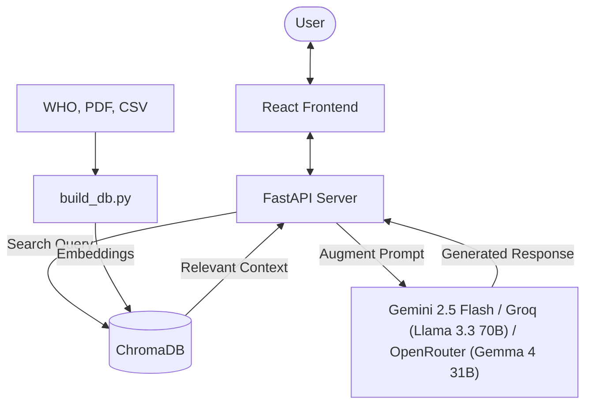

# MediChat: Smart Disease Education Chatbot


```mermaid
graph TD
    User([User]) <--> Frontend[React Frontend]

    Frontend <--> Backend[FastAPI Server]

    Backend -- Search Query --> VectorDB[(ChromaDB)]

    VectorDB -- Relevant Context --> Backend

    Backend -- Augment Prompt --> LLM["Gemini 2.5 Flash / Groq (Llama 3.3 70B) / OpenRouter (Gemma 4 31B)"]

    LLM -- Generated Response --> Backend

    Data[WHO, PDF, CSV] --> Ingest[build_db.py]

    Ingest -- Embeddings --> VectorDB
```

MediChat is a Retrieval-Augmented Generation (RAG) chatbot designed to provide calm, accessible educational information about diseases. It combines a modern React frontend with a FastAPI backend, ChromaDB for vector storage, and multiple LLM providers for response generation.

## Key Features

- **RAG Architecture**: Retrieves relevant chunks from a curated medical knowledge base to provide context for responses.

- **Multi-Source Ingestion**: Automatically processes 236 WHO HTML fact sheets, one WHO PDF, and a Mendeley CSV dataset supplied by the project mentor.

- **Multi-Provider Support**: Supports Google Gemini, Groq, and OpenRouter as interchangeable LLM backends.

- **Smart Formatting**: Frontend supports full Markdown rendering for clear medical lists and bold highlights.

- **API Quota Management**: Built-in optional chunk sampling to handle free-tier API limits during large data ingestion.

- **Empathetic UI**: Designed with a glassmorphism aesthetic, micro-animations, and a supportive tone.

## Tech Stack

- **Frontend**: React (Vite), Tailwind CSS, Framer Motion, Lucide Icons.

- **Backend**: FastAPI, Uvicorn, Python.

- **AI/ML**: Google Gemini API (`gemini-2.5-flash`); Groq API (`llama-3.3-70b-versatile`); OpenRouter API (`google/gemma-4-31b-it:free` or any free model). Gemini uses `gemini-embedding-001`, while Groq and OpenRouter use local `all-MiniLM-L6-v2` embeddings.

- **Vector Store**: ChromaDB.

- **Data Processing**: BeautifulSoup4, PyPDF, Pandas.

- **Statistics**: NumPy, SciPy (`evaluation/statistical_analysis.py`).

## Prerequisites

- Python 3.10+

- Node.js & NPM

- A Google Gemini API Key, Groq API Key, or OpenRouter API Key, depending on which backend you use.

## Setup & Installation

### 1. Environment Setup

Create a `.env` file in the root directory:

```env
GEMINI_API_KEY=your_gemini_api_key_here
GROQ_API_KEY=your_groq_api_key_here
OPENROUTER_API_KEY=your_openrouter_api_key_here
```

### 2. Backend Installation

```bash
python3 -m venv .venv
source .venv/bin/activate
pip install -r requirements.txt
```

### 3. Frontend Installation

```bash
cd frontend
npm install
cd ..
```

## Running the Application

### Phase 1: Build the Knowledge Base

Ingest the medical data into the vector database:

```bash
# Gemini
python3 vectorstore/build_db.py

# Groq
python3 vectorstore/build_db_groq.py

# OpenRouter
# Uses the same local sentence-transformers embeddings as Groq
python3 vectorstore/build_db_open_router.py
```

**Note:** You can adjust `SAMPLE_SIZE` in `build_db.py` to limit the number of new chunks ingested per run.

### Phase 2: Start the Backend

```bash
# Gemini
python3 -m uvicorn main:app --reload

# Groq
python3 -m uvicorn main_groq:app --reload

# OpenRouter
python3 -m uvicorn main_open_router:app --reload
```

### Phase 3: Start the Frontend

```bash
cd frontend
npm run dev
```

## How it Works (RAG Flow)

1. **Ingestion**: The ingestion scripts extract text from HTML, PDF, and CSV sources, split it into chunks, and generate embeddings. Gemini uses `gemini-embedding-001` through the API; Groq and OpenRouter use local `all-MiniLM-L6-v2`.

2. **Storage**: Embeddings and metadata are stored in local ChromaDB instances (`chroma_db/`, `chroma_db_groq/`, `chroma_db_open_router/`).

3. **Retrieval**: When a user asks a question, the server embeds the query and searches ChromaDB for the most relevant context chunks.

4. **Augmentation**: The retrieved context is injected into a specialized `SYSTEM_PROMPT` that instructs the model to respond with a calm, educational tone.

5. **Generation**: The configured LLM generates a response using the retrieved context.

6. **Formatting**: The frontend renders the response as Markdown for a clean, professional presentation.

## Evaluation

The final RAG pipeline is evaluated on a test dataset of **70 medical questions** covering diseases, mental health, injuries, symptoms, prevention, treatment, and other health-related topics.

The initial evaluation set contained 50 questions. It was later extended with **20 additional, more challenging questions** to provide a broader and more discriminative evaluation of the system.

Each question contains:

- a medical question,
- a reference answer (`ground_truth`),
- one or more expected sources (`expected_sources`).

The evaluation covers both **retrieval quality** and **generated-answer quality**.

Retrieval is evaluated using automatic retrieval metrics, while generated answers are evaluated using an LLM-as-a-Judge approach.

### Running the Evaluation

```bash
# Gemini — retrieval only, all 70 questions
python -m evaluation.evaluate --retrieval-only

# Gemini — full 70-question evaluation with LLM-as-a-Judge
python -m evaluation.evaluate

# Gemini — small sample
python -m evaluation.evaluate --judge-sample 5

# Groq — retrieval only
python -m evaluation.evaluate_groq --retrieval-only

# OpenRouter — retrieval only
python -m evaluation.evaluate_open_router --retrieval-only
```

To add judge scores onto an existing retrieval JSON (resume-safe; recommended when quota is limited):

```bash
python -m evaluation.evaluate \
  --augment-results evaluation/results_with_judge.json \
  --judge-sample 25 \
  --judge-metrics context_relevance,correctness \
  --output evaluation/results_with_judge.json
```

`--judge-sample` selects evenly spaced questions. Running `python -m evaluation.evaluate` without a sample limit evaluates all 70 Gemini questions.

In `--augment-results` mode, re-running the same command skips existing scores. A plain full run writes its JSON after completion.

## Evaluation Metrics

### Retrieval Metrics

The retrieval component is evaluated using three metrics:

- **Hit Rate** — whether at least one expected source was retrieved for a question.
- **Mean Reciprocal Rank (MRR)** — measures how highly the first expected source is ranked.
- **Source Precision** — measures the proportion of retrieved chunks originating from the expected source.

### LLM-as-a-Judge Metrics

Generated answers are evaluated using four metrics:

- **Faithfulness** — whether the generated answer is supported by the retrieved context.
- **Answer Relevance** — whether the generated answer directly addresses the question.
- **Context Relevance** — whether the retrieved context is useful for answering the question.
- **Correctness** — agreement between the generated answer and the reference answer.

## Retrieval Metrics (Gemini — 70 questions)

| Metric | Score | Description |
|---|---:|---|
| **Hit Rate** | 1.00 | At least one expected source was retrieved for every evaluated question |
| **MRR** | 0.95 | Expected sources were generally ranked at or near the top |
| **Source Precision** | 0.70 | 70% of retrieved chunks came from the expected sources |

The results show that the retrieval component successfully identified at least one expected source for every question in the final 70-question evaluation set.

An MRR of 0.95 indicates that expected sources were generally ranked very highly among retrieved results, while a Source Precision of 0.70 indicates that most retrieved chunks originated from the expected sources.

## Retrieval Metrics (Groq — Llama 3.3 70B, n = 50)

The Groq retrieval experiment was performed on the original 50-question evaluation set.

| Metric | Score | Description |
|---|---:|---|
| **Hit Rate** | 1.00 | At least one expected source was retrieved for each of the original 50 questions |
| **MRR** | 0.89 | Expected sources usually appeared near the top of the retrieved list |
| **Source Precision** | 0.58 | 58% of retrieved chunks came from the expected source |
| **Retrieval Average** | 0.82 | Unweighted mean of the three retrieval metrics |

## Retrieval Metrics (OpenRouter — Gemma 4 31B, n = 50)

The OpenRouter retrieval experiment was performed on the original 50-question evaluation set.

| Metric | Score | Description |
|---|---:|---|
| **Hit Rate** | 1.00 | At least one expected source was retrieved for each of the original 50 questions |
| **MRR** | 0.88 | Expected sources usually appeared near the top of the retrieved list |
| **Source Precision** | 0.59 | 59% of retrieved chunks came from the expected source |
| **Retrieval Average** | 0.82 | Unweighted mean of the three retrieval metrics |

## Evaluation Coverage

The final **Gemini RAG evaluation covers all 70 questions** and includes both retrieval metrics and LLM-as-a-Judge answer-quality metrics.

The Groq and OpenRouter retrieval experiments were performed on the **original 50-question evaluation set** and are retained as backend retrieval comparisons. These two configurations were not rerun on the additional 20-question extension.

A **No-RAG Gemini baseline** was also evaluated on the same final 70-question dataset. This allows generated-answer quality to be compared with and without retrieval while keeping the underlying language model and evaluation questions consistent.

## Gemini RAG LLM-as-a-Judge Results (70 questions)

Gemini 2.5 Flash was used for answer generation and automated LLM-as-a-Judge evaluation.

These scores represent automated assessments on the evaluation dataset and should not be interpreted as independent clinical validation.

| Metric | Mean Score | What it evaluates |
|---|---:|---|
| **Faithfulness** | 0.98 | Whether the answer is grounded in retrieved context |
| **Answer Relevance** | 0.99 | Whether the answer addresses the question |
| **Context Relevance** | 0.83 | Whether retrieved chunks are useful for the question |
| **Correctness** | 0.97 | Agreement with the reference answer |

The evaluation script reports an overall descriptive score of **0.92**, calculated as an unweighted average across retrieval and LLM-as-a-Judge metrics.

This aggregate score is used only as a descriptive summary and should not be interpreted as a validated measure of medical accuracy.

## RAG vs No-RAG Baseline (70 questions)

To examine the contribution of retrieval, Gemini 2.5 Flash was also evaluated without RAG on the same **70-question test set**.

In the No-RAG configuration, the model receives the question without retrieving or receiving context from the medical knowledge base.

Only metrics that are applicable to both configurations are compared directly.

| Metric | RAG | No-RAG |
|---|---:|---:|
| **Answer Relevance** | 0.9917 | 0.9980 |
| **Correctness** | 0.9711 | 0.9869 |

The No-RAG configuration achieved slightly higher mean scores for both shared metrics.

The relatively small differences indicate that Gemini 2.5 Flash already possesses strong prior knowledge for many of the medical topics represented in the evaluation set.

However, Answer Relevance and Correctness do not measure whether an answer is grounded in a controlled source collection. The RAG configuration additionally retrieves information from the curated medical corpus and achieved:

- **Hit Rate:** 1.00
- **MRR:** 0.95
- **Source Precision:** 0.70
- **Faithfulness:** 0.98
- **Context Relevance:** 0.83

Retrieval-specific metrics are not applicable to the No-RAG configuration because no retrieval step is performed.

Faithfulness is also not directly compared because, in the RAG evaluation, it measures whether the generated answer is supported by the retrieved context.

## 🧪 Extended Challenge Subset (Questions 51–70)

The final evaluation set includes 20 additional questions designed to provide a more challenging evaluation of the system.

The RAG pipeline maintained strong performance on this subset.

### RAG — Challenge Subset

| Metric | Score |
|---|---:|
| **Hit Rate** | 1.00 |
| **MRR** | 1.00 |
| **Source Precision** | 0.765 |
| **Faithfulness** | 0.9675 |
| **Answer Relevance** | 0.989 |
| **Context Relevance** | 0.9075 |
| **Correctness** | 0.980 |

An MRR of 1.00 means that the expected source was ranked first for all 20 questions in the challenge subset.

The Context Relevance score of 0.9075 also indicates that the retrieved chunks were highly relevant to these questions.

### RAG vs No-RAG — Challenge Subset

| Metric | RAG | No-RAG |
|---|---:|---:|
| **Answer Relevance** | 0.989 | 0.998 |
| **Correctness** | 0.980 | 0.990 |

Both configurations therefore maintained high generated-answer quality on the additional challenge questions.

The challenge subset is reported as a secondary analysis, while the primary reported evaluation uses the complete 70-question dataset.

## Statistical Analysis

Automatic retrieval metrics and LLM-as-a-Judge scores measure related but different properties of the RAG pipeline.

The statistical analysis therefore distinguishes between:

1. relationships between retrieval quality and generated-answer quality; and
2. paired comparisons between configurations evaluated on the same questions.

### Automatic Retrieval Metrics vs LLM-as-a-Judge

For retrieval-to-generation analysis, Spearman rank correlation is used to examine monotonic associations between retrieval and judge metrics.

- **Primary test:** Spearman rank correlation with a 95% bootstrap confidence interval.
- **Hypotheses:** H₀: ρ = 0 vs H₁: ρ ≠ 0, α = 0.05.
- **Multiple comparisons:** Holm–Bonferroni correction.
- **Hit Rate** is excluded when constant because correlation is undefined without variance.
- **Pearson r** may be reported as a secondary check.

The analysis can be run with:

```bash
python -m evaluation.statistical_analysis auto-vs-judge \
  evaluation/results.json \
  --report-mk evaluation/statistical_report_mk.md \
  --json-out evaluation/statistical_report.json
```

For a single retrieval/judge pair:

```bash
python -m evaluation.statistical_analysis correlate \
  evaluation/results.json \
  --retrieval mrr \
  --judge correctness
```

### Backend Comparison

The same automatic retrieval metric can also be compared between two backends when the same questions were evaluated.

```bash
python -m evaluation.statistical_analysis compare \
  evaluation/results.json \
  evaluation/results_open_router.json \
  --metric source_precision
```

The existing Groq/OpenRouter backend comparisons are based on the original **50-question dataset**.

### RAG vs No-RAG Statistical Comparison

RAG and No-RAG are evaluated on the same questions, making the observations paired.

The primary shared metrics are:

- Answer Relevance
- Correctness

The paired analysis should examine the distribution of question-level differences before selecting the appropriate statistical test. The existing statistical analysis implementation uses Shapiro–Wilk to assess the paired differences and selects an assumption-aware paired test such as the paired t-test or Wilcoxon signed-rank test.

Bootstrap confidence intervals can additionally be used to estimate uncertainty around the mean paired difference.

The final 70-question statistical results should be generated from the saved RAG and No-RAG JSON files before being reported here.

## Evaluation Limitations

The evaluation has several important limitations.

First, the final dataset contains 70 manually selected medical questions and therefore cannot represent every possible user question or medical scenario.

Second, the same Gemini 2.5 Flash model is used for response generation and automated LLM-as-a-Judge evaluation. The judge scores are therefore not an independent clinical assessment and may reflect model-specific preferences.

Third, several answer-quality metrics are close to their upper bounds, particularly Answer Relevance. This ceiling effect can reduce the ability of the evaluation to distinguish between already strong answers.

Finally, the reference answers and retrieved source material may occasionally differ in wording, level of detail, or interpretation. As a result, a generated answer that follows the retrieved medical source may receive a lower Correctness score when it does not closely match the reference answer.

The results should therefore be interpreted as an evaluation of the implemented RAG system on this specific dataset rather than as clinical validation of the chatbot.

## Medical Disclaimer

This application is for educational purposes only and should not be used as a substitute for professional medical advice, diagnosis, or treatment.

## Screenshots


