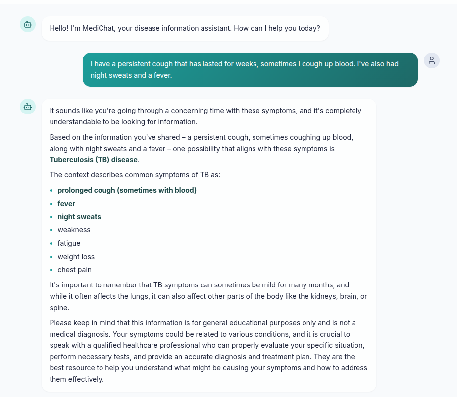
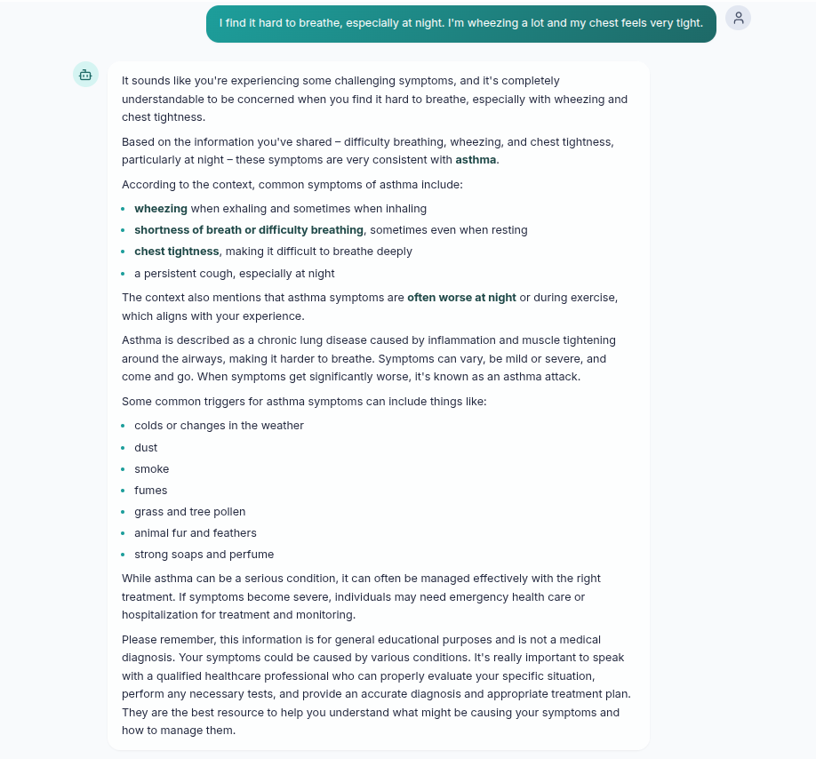
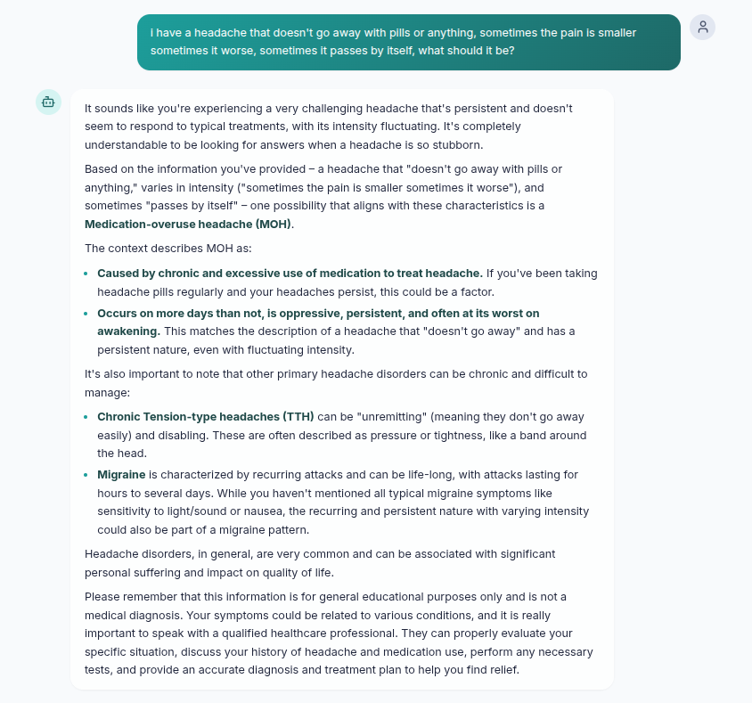

# MediChat: Smart Disease Education Chatbot


```mermaid
graph TD
    User([User]) <--> Frontend[React Frontend]
    Frontend <--> Backend[FastAPI Server]
    Backend -- Search Query --> VectorDB[(ChromaDB)]
    VectorDB -- Relevant Context --> Backend
    Backend -- Augment Prompt --> LLM["Gemini 2.5 Flash / Groq (Llama 3.3 70B) / OpenRouter (Gemma 4 31B)"]
    LLM -- Generated Response --> Backend
    Data[WHO, PDF, CSV] --> Ingest[build_db.py]
    Ingest -- Embeddings --> VectorDB
```

MediChat is a Retrieval-Augmented Generation (RAG) chatbot designed to provide calm, accessible educational information about diseases. It combines a modern React frontend with a powerful FastAPI backend, utilizing ChromaDB for vector storage and a choice of AI providers for generation.

## 🚀 Key Features

-   **RAG Architecture**: Retrieves relevant chunks from a curated medical knowledge base to provide context for responses.

-   **Multi-Source Ingestion**: Automatically processes 236 WHO HTML fact sheets, one WHO PDF, and a Mendeley CSV dataset supplied by the project mentor.

-   **Multi-Provider Support**: Supports Google Gemini, Groq, and OpenRouter as interchangeable LLM backends.

-   **Smart Formatting**: Frontend supports full Markdown rendering for clear medical lists and bold highlights.

-   **API Quota Management**: Built-in optional chunk sampling to handle free-tier API limits during large data ingestion.

-   **Empathetic UI**: Designed with a "glassmorphism" aesthetic, micro-animations, and a supportive tone.

## 🛠️ Tech Stack

-   **Frontend**: React (Vite), Tailwind CSS, Framer Motion, Lucide Icons.

-   **Backend**: FastAPI, Uvicorn, Python.

-   **AI/ML**: Google Gemini API (`gemini-2.5-flash`); Groq API (`llama-3.3-70b-versatile`); OpenRouter API (`google/gemma-4-31b-it:free` or any free model); Gemini uses `gemini-embedding-001`, while Groq and OpenRouter use local `all-MiniLM-L6-v2` embeddings.

-   **Vector Store**: ChromaDB.

-   **Data Processing**: BeautifulSoup4, PyPDF, Pandas.

-   **Statistics**: NumPy, SciPy (`evaluation/statistical_analysis.py`).

## 📋 Prerequisites

-   Python 3.10+

-   Node.js & NPM

-   A Google Gemini API Key, Groq API Key, or OpenRouter API Key (depending on which backend you use)

## ⚙️ Setup & Installation

### 1. Environment Setup

Create a `.env` file in the root directory:

```env
GEMINI_API_KEY=your_gemini_api_key_here
GROQ_API_KEY=your_groq_api_key_here
OPENROUTER_API_KEY=your_openrouter_api_key_here
```

### 2. Backend Installation

```bash
python3 -m venv .venv
source .venv/bin/activate
pip install -r requirements.txt
```

### 3. Frontend Installation

```bash
cd frontend
npm install
cd ..
```

## 🏃 Running the Application

### Phase 1: Build the Knowledge Base

Ingest the medical data into the vector database:

```bash
# Gemini
python3 vectorstore/build_db.py
# Groq
python3 vectorstore/build_db_groq.py
# OpenRouter (uses the same local sentence-transformers embeddings as Groq)
python3 vectorstore/build_db_open_router.py
```

**Note: You can adjust `SAMPLE_SIZE` in `build_db.py` to limit the number of new chunks ingested per run.**

### Phase 2: Start the Backend

```bash
# Gemini
python3 -m uvicorn main:app --reload
# Groq
python3 -m uvicorn main_groq:app --reload
# OpenRouter
python3 -m uvicorn main_open_router:app --reload
```

### Phase 3: Start the Frontend

```bash
cd frontend
npm run dev
```

## 🧠 How it Works (RAG Flow)

1.  **Ingestion**: The ingestion scripts extract text from HTML, PDF, and CSV sources, split it into chunks, and generate embeddings. Gemini uses `gemini-embedding-001` through the API; Groq and OpenRouter use local `all-MiniLM-L6-v2`.

2.  **Storage**: Embeddings and metadata are stored in a local ChromaDB instance (`chroma_db/`, `chroma_db_groq/`, `chroma_db_open_router/`).

3.  **Retrieval**: When a user asks a question, the server embeds the query and searches ChromaDB for the most relevant context chunks.

4.  **Augmentation**: The context is injected into a specialized `SYSTEM_PROMPT` that instructs the model to respond with a calm, educational tone.

5.  **Generation**: The configured LLM generates a response using the retrieved context.

6.  **Formatting**: The frontend renders the response as Markdown for a clean, professional look.

## 📊 Evaluation

The RAG pipeline is evaluated using retrieval quality metrics over a test dataset of 50 medical questions covering diseases, mental health, injuries, and more. Automatic retrieval scores can be compared with optional LLM-as-a-Judge scores using Spearman correlation (see [Statistical comparison](#statistical-comparison-automatic-metrics-vs-llm-as-a-judge)).

### Running the Evaluation

```bash
# Gemini — retrieval only
python -m evaluation.evaluate --retrieval-only
# Gemini — full 50-question LLM-as-judge run
python -m evaluation.evaluate
# Gemini — small 5-question sample
python -m evaluation.evaluate --judge-sample 5
# Groq — retrieval only
python -m evaluation.evaluate_groq --retrieval-only
# Groq — full LLM-as-judge
python -m evaluation.evaluate_groq --limit 5
# OpenRouter — retrieval only
python -m evaluation.evaluate_open_router --retrieval-only
# OpenRouter — full LLM-as-judge
python -m evaluation.evaluate_open_router --limit 5
```

To add judge scores onto an existing retrieval JSON (resume-safe; recommended when quota is limited):

```bash
python -m evaluation.evaluate \
  --augment-results evaluation/results_with_judge.json \
  --judge-sample 25 \
  --judge-metrics context_relevance,correctness \
  --output evaluation/results_with_judge.json
```

`--judge-sample` selects evenly spaced questions. Run `python -m evaluation.evaluate` without a sample limit to judge all 50 Gemini questions on all four metrics. In `--augment-results` mode, re-running the same command skips existing scores. A plain full run writes its JSON only after completion.

### Retrieval Metrics (Gemini)

| Metric | Score | Description |
|---|---|---|
| **Hit Rate** | 1.00 | At least one expected source was retrieved for each of these 50 questions |
| **MRR** | 0.94 | Expected source usually appears near the top of the retrieved list |
| **Source Precision** | 0.68 | 68% of retrieved chunks come from the expected source |
| **Retrieval average** | 0.87 | Unweighted mean of the three retrieval metrics |

### Retrieval Metrics (Groq — Llama 3.3 70B)

| Metric | Score | Description |
|---|---|---|
| **Hit Rate** | 1.00 | At least one expected source was retrieved for each of these 50 questions |
| **MRR** | 0.89 | Expected source usually appears near the top of the retrieved list |
| **Source Precision** | 0.58 | 58% of retrieved chunks come from the expected source |
| **Retrieval average** | 0.82 | Unweighted mean of the three retrieval metrics |

### Retrieval Metrics (OpenRouter — Gemma 4 31B)

| Metric | Score | Description |
|---|---|---|
| **Hit Rate** | 1.00 | At least one expected source was retrieved for each of these 50 questions |
| **MRR** | 0.88 | Expected source usually appears near the top of the retrieved list |
| **Source Precision** | 0.59 | 59% of retrieved chunks come from the expected source |
| **Retrieval average** | 0.82 | Unweighted mean of the three retrieval metrics |

### Evaluation coverage

Retrieval metrics were calculated for all 50 questions in each of the three configurations. The LLM-as-a-Judge results reported here cover all 50 Gemini answers. The Groq and OpenRouter figures below describe retrieval performance; answer-quality results for those configurations are not included in this report.

### Gemini LLM-as-a-Judge results (50 questions)

The same Gemini 2.5 Flash model generated the answers and scored them. These are automated assessments on this test set, not independent clinical validation. Groq and OpenRouter have retrieval results above; the judge scores below apply only to Gemini.

| Metric | Mean score | What it evaluates |
|---|---:|---|
| Faithfulness | 0.98 | Whether the answer is grounded in retrieved context |
| Answer Relevance | 0.99 | Whether the answer addresses the question |
| Context Relevance | 0.80 | Whether retrieved chunks are useful for the question |
| Correctness | 0.96 | Agreement with the reference answer |

The evaluation script also prints an overall score of **0.91**, an unweighted average across retrieval and judge metrics. It is a descriptive aggregate, not a validated measure of medical accuracy.

### Statistical comparison (automatic metrics vs LLM-as-a-Judge)

Automatic retrieval metrics and LLM-as-a-Judge scores measure related but different constructs on the **same questions**. The analysis therefore tests **monotonic association** (Spearman’s ρ), not equality of means.

- **Primary test:** Spearman rank correlation with a 95% bootstrap CI.

- **Hypotheses:** H₀: ρ = 0 vs H₁: ρ ≠ 0, α = 0.05.

- **Multiple comparisons:** Holm–Bonferroni across metric pairs.

- **Hit Rate** is excluded when it is constant (currently 1.0 on the saved results); correlation is undefined without variance.

- **Pearson r** is reported only as a secondary check; paired t / Wilcoxon / Mann–Whitney U are not used for auto ↔ judge comparison.

```bash
# Primary analysis (needs judge_scores in the JSON)
python -m evaluation.statistical_analysis auto-vs-judge \
  evaluation/results.json \
  --report-mk evaluation/statistical_report_mk.md \
  --json-out evaluation/statistical_report.json
# Single pair
python -m evaluation.statistical_analysis correlate \
  evaluation/results.json --retrieval mrr --judge correctness
# Same metric across two backends (assumption-aware paired t or Wilcoxon)
python -m evaluation.statistical_analysis compare \
  evaluation/results.json evaluation/results_open_router.json \
  --metric source_precision
```

Macedonian methods/results text is written to `evaluation/statistical_report_mk.md` (for the final report).

#### Current auto ↔ judge results (Gemini, n = 50)

The table shows the four planned comparisons. The analysis script also computes exploratory pairs with faithfulness and answer relevance; none was significant after Holm correction. Hit Rate is 1.00 for every question, so its correlation is undefined. The eight tested pairs were included in the Holm adjustment.

| Pair | Spearman ρ | p | p (Holm) | 95% bootstrap CI |
|---|---:|---:|---:|---|
| Source Precision ↔ Context Relevance | 0.253 | 0.0762 | 0.6095 | [−0.027, 0.501] |
| MRR ↔ Context Relevance | 0.038 | 0.7939 | 1.0000 | [−0.247, 0.316] |
| Source Precision ↔ Correctness | −0.140 | 0.3309 | 1.0000 | [−0.405, 0.159] |
| MRR ↔ Correctness | 0.026 | 0.8567 | 1.0000 | [−0.226, 0.329] |

No tested association was statistically significant after correction, and these intervals include zero. The results do not establish that retrieval quality is unrelated to answer quality. Scores near the upper bound for faithfulness, answer relevance, and correctness may also limit how well this test distinguishes answers.

#### Backend comparison (Gemini vs OpenRouter, n = 50)

Same automatic metric, paired by question. Shapiro–Wilk on paired differences chooses the test.

| Metric | Test | Mean difference | p | Effect size | 95% CI (mean diff) |
|---|---|---|---|---|---|
| source_precision | paired t | 0.088 | 0.0008 | Cohen’s d = 0.50 | [0.04, 0.14] |
| mrr | Wilcoxon signed-rank | 0.061 | 0.075 | rank-biserial = 0.60 | [0.00, 0.12] |

Gemini source precision was higher on this paired test set (Cohen’s d = 0.50). The MRR difference is not significant at α = 0.05.

## 🛡️ Medical Disclaimer

This application is for educational purposes only and should not be used as a substitute for professional medical advice, diagnosis, or treatment.

## 📸 Screenshots





